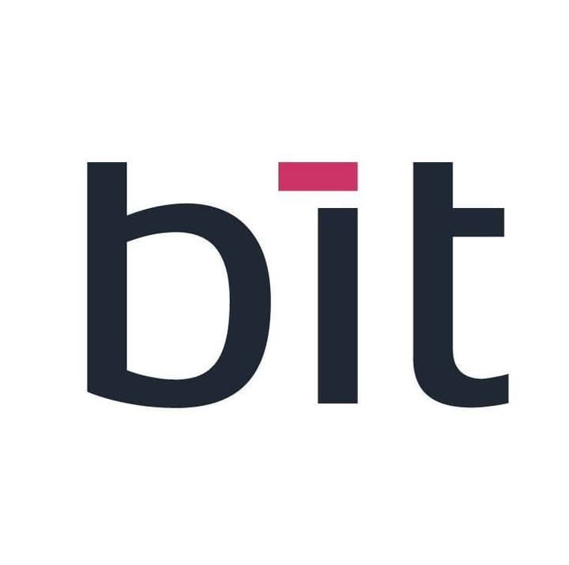

# BIT Study HUB — Burkina Institute of Technology

> Plateforme collaborative des étudiants en Computer Science du BIT.
> Cours, examens, corrigés, flashcards — centralisés, structurés et accessibles.



## 🎯 À propos

**BIT Study HUB** est une plateforme web académique conçue pour les étudiants de la filière Computer Science du **Burkina Institute of Technology (BIT)**, située à **Koudougou, Burkina Faso**. Elle centralise et démocratise l'accès aux ressources d'apprentissage clés : résumés de cours détaillés par chapitre, sujets d'examens avec corrections, fiches de synthèse, et séries d'exercices d'entraînement pour les semestres S1 et S2.

La plateforme intègre une dimension collaborative (crowdsourcing) permettant à la communauté étudiante de contribuer en proposant de nouveaux documents, le tout encadré par un système de gamification (points, badges, classement).

## ✨ Fonctionnalités principales

### 📚 Bibliothèque de contenus (14 cours, 90 chapitres)
- **14 cours** répartis sur 8 catégories (Mathématiques, Programmation, Système, Électronique, Physique, Management, Langues, Bureautique)
- **90 chapitres** détaillés — chaque cours dispose de son propre dossier avec un fichier HTML par chapitre
- **26 sujets d'examens** avec sujet + correction détaillée — chaque examen a son propre dossier
- **58 flashcards** interactives pour la révision
- **20 contributeurs** simulés avec badges et niveaux

### 🔍 Recherche & Navigation
- Moteur de recherche global multi-critères (cours, examens, chapitres, flashcards)
- Filtrage par semestre, type, catégorie, statut (vérifié, corrigé)
- Fil d'Ariane et navigation contextuelle
- Tri et pagination des résultats

### 📤 Contribution collaborative
- Formulaire d'upload multi-étapes (PDF, PNG, JPEG)
- Workflow de modération : Soumission → Relecture → Publication
- Classification automatique (module, semestre, année, type)
- Système de validation par les majors de promotion

### 🏆 Gamification complète
- Système de points (50pts/soumission, 100pts/corrigé vérifié)
- **5 badges** : Master Contributor, Eagle Eye, Hero du S1, Corrigé Vérifié, Mentor
- **6 niveaux** : Novice → Contributeur → Habitué → Confirmé → Expert → Légende
- Classement des 20 contributeurs (leaderboard) avec podium top 3

### 🎨 Design & UX
- **Mode sombre automatique** (suit les préférences système) + toggle manuel
- **Responsive mobile-first** (iPhone 14 → Desktop 4K)
- **Accessibilité** : skip links, focus visible, ARIA labels, contrastes WCAG
- **PWA installable** : manifest + service worker pour le mode hors-ligne
- **Performance** : lazy loading des images, cache, animations fluides

### 🃏 Flashcards interactives
- Cartes mémoire 3D avec effet de flip
- Marquage "Maîtrisé" / "À revoir" persistant (localStorage)
- Filtrage par difficulté (facile/moyen/difficile) et par cours
- Mode aléatoire (shuffle) et progression suivie

## 🛠️ Stack technique

| Couche | Technologie |
|--------|-------------|
| **HTML** | HTML5 sémantique, accessible |
| **CSS** | CSS3 avec variables, flexbox/grid, dark mode natif |
| **JavaScript** | Vanilla JS (ES6+), modules, aucune dépendance |
| **Données** | JSON statique (4 fichiers : courses, exams, contributors, flashcards) |
| **PWA** | manifest.json + sw.js (Service Worker pour cache offline) |
| **Polices** | Montserrat (titres), Inter (corps), JetBrains Mono (code) — Google Fonts |

**Aucune dépendance externe** : pas de React, pas de Next.js, pas de Tailwind. 100% vanilla pour une portabilité maximale.

## 📁 Arborescence du projet

```
bit-study-hub/
├── index.html                  # Page d'accueil (hero, recherche, stats, top)
├── cours.html                  # Liste filtrable des 14 cours
├── examens.html                # Galerie filtrable des 26 examens
├── flashcards.html             # Révision interactive (58 cartes)
├── leaderboard.html            # Classement des 20 contributeurs
├── contribution.html           # Formulaire d'upload multi-étapes
├── a-propos.html               # À propos + équipe + contact
├── manifest.json               # PWA manifest
├── sw.js                       # Service Worker (offline)
├── README.md                   # Ce fichier
├── css/
│   └── styles.css              # Design system complet (~1540 lignes)
├── js/
│   ├── app.js                  # Application principale (theme, nav, search, toast)
│   └── icons.js                # Bibliothèque d'icônes SVG (~70 icônes)
├── data/
│   ├── courses.json            # 14 cours + 90 chapitres + métadonnées
│   ├── exams.json              # 26 examens avec URLs sujet/correction
│   ├── contributors.json       # 20 contributeurs + 5 badges + 6 niveaux
│   ├── flashcards.json         # 58 cartes de révision
│   └── site.json               # Configuration globale du site
├── assets/
│   └── img/
│       └── bit-logo.jpeg       # Logo officiel du BIT
├── exams-images/               # 26 images d'examens (examen-01 à 26.jpeg)
│
├── cours/                      # 📚 14 dossiers de cours (1 par cours)
│   ├── programmation-python/   # CS101 — 3 chapitres
│   │   ├── index.html          # Page d'aperçu du cours
│   │   ├── chapitre-01-introduction.html
│   │   ├── chapitre-02-resume-du-cours.html
│   │   └── chapitre-03-exercices-corriges.html
│   ├── langage-c/              # CS102 — 12 chapitres
│   │   ├── index.html
│   │   ├── chapitre-01-introduction-structure.html
│   │   ├── chapitre-02-types-variables-entrees-sorties.html
│   │   ├── chapitre-03-operateurs-conversions.html
│   │   ├── chapitre-04-structures-controle.html
│   │   ├── chapitre-05-tableaux-fonctions.html
│   │   ├── chapitre-06-pointeurs-allocation-dynamique.html
│   │   ├── chapitre-07-chaines-caracteres.html
│   │   ├── chapitre-08-structures-listes-chainees.html
│   │   ├── chapitre-09-fichiers-compilation-separee.html
│   │   └── ... (3 chapitres supplémentaires)
│   ├── vba/                    # CS103 — 3 chapitres
│   ├── architecture-ordinateurs/  # CS104 — 3 chapitres
│   ├── reseaux-informatiques/  # CS105 — 3 chapitres
│   ├── outils-bureautiques/    # CS106 — 10 chapitres
│   ├── electronique-numerique/ # CS107 — 6 chapitres (contenu généré)
│   │   ├── index.html
│   │   ├── chapitre-01-systemes-de-numeration.html
│   │   ├── chapitre-02-algebre-de-boole.html
│   │   ├── chapitre-03-portes-logiques.html
│   │   ├── chapitre-04-logique-combinatoire.html
│   │   ├── chapitre-05-logique-sequentielle.html
│   │   └── chapitre-06-compteurs-registres.html
│   ├── electronique-analogique/  # CS108 — 3 chapitres
│   ├── algorithmique-dynamique/  # CS109 — 3 chapitres
│   ├── geometrie-optique/      # PH101 — 4 chapitres
│   ├── gestion-de-projet/      # MG101 — 3 chapitres
│   ├── management-financier/   # MG102 — 11 chapitres
│   ├── anglais-technique/      # EN101 — 20 chapitres
│   └── mathematiques/          # MA — 6 chapitres (Analyse I/II, Algèbre, Proba-Stats, Scientific Computing)
│       ├── index.html
│       ├── chapitre-01-analyse-i-nombres-reels-suites-continuite.html
│       ├── chapitre-02-analyse-ii-integration-series-equations-differentielles.html
│       ├── chapitre-03-algebre-generale-structures-groupes-anneaux.html
│       ├── chapitre-04-algebre-lineaire-espaces-vectoriels-matrices.html
│       ├── chapitre-05-probabilites-et-statistiques.html
│       └── chapitre-06-scientific-computing-calcul-numerique.html
│
└── examens/                    # 📝 26 dossiers d'examens (1 par examen)
    ├── examen-01-probabilites-distribution-normale/
    │   ├── index.html          # Aperçu de l'examen (image, badges, CTAs)
    │   ├── sujet.html          # Visionneuse du sujet (zoom, rotation, download)
    │   └── correction.html     # Correction détaillée pédagogique
    ├── examen-02-probabilites-distribution-normale-2/
    │   └── (index + sujet + correction)
    ├── ...
    └── examen-26-anglais-technique-vocabulaire/
        └── (index + sujet + correction)
```

## 📊 Données & contenu

### Cours (14 modules, 90 chapitres)

| Code | Titre | Semestre | Catégorie | Chapitres |
|------|-------|----------|-----------|-----------|
| CS101 | Programmation Python | S1 | Programmation | 3 |
| CS102 | Langage C | S1 | Programmation | 12 |
| CS103 | VBA | S2 | Programmation | 3 |
| CS104 | Architecture des Ordinateurs | S1 | Système | 3 |
| CS105 | Réseaux Informatiques | S2 | Système | 3 |
| CS106 | Outils Bureautiques | S1 | Bureautique | 10 |
| CS107 | Électronique Numérique | S1 | Électronique | 6 |
| CS108 | Électronique Analogique | S1 | Électronique | 3 |
| CS109 | Algorithmique Dynamique | S2 | Programmation | 3 |
| MA | Mathématiques | S1+S2 | Math | 6 |
| PH101 | Géométrie Optique | S1 | Physique | 4 |
| MG101 | Gestion de Projet | S2 | Management | 3 |
| MG102 | Management Financier | S2 | Management | 11 |
| EN101 | Anglais Technique | S1 | Langues | 20 |

### Examens (26 sujets, chacun avec correction)

Distribution par matière :
- Mathématiques : 10 sujets (Analyse I/II, Algèbre Générale/Linéaire, Proba-Stats)
- Programmation : 6 sujets (Python, C, Algorithmique)
- Système : 3 sujets (Architecture, Réseaux ×2)
- Électronique : 2 sujets (Numérique, Analogique)
- Physique : 1 sujet (Optique)
- Management : 3 sujets (Comptabilité, Finance, Gestion de projet)
- Langues : 1 sujet (Anglais technique)

### Gamification

**6 niveaux** (du Novice à la Légende) :
| Niveau | Points | Couleur |
|--------|--------|---------|
| Novice | 0 - 199 | Gris |
| Contributeur | 200 - 599 | Violet |
| Habitué | 600 - 1199 | Bleu |
| Confirmé | 1200 - 1799 | Teal |
| Expert | 1800 - 2499 | Orange |
| Légende | 2500+ | Rose fuchsia |

**5 badges** :
| Badge | Icône | Critère |
|-------|-------|---------|
| Master Contributor | Couronne | 30+ contributions validées |
| Eagle Eye | Œil | 5 corrigés vérifiés sans erreur |
| Hero du S1 | Bouclier | Couverture complète d'un module S1 |
| Corrigé Vérifié | Check | Au moins 1 contribution vérifiée |
| Mentor | Cœur | A aidé 5+ étudiants via commentaires |

## 🚀 Installation & utilisation

### Option 1 : Ouverture directe
Double-cliquez sur `index.html` — toutes les fonctionnalités sauf la recherche globale (qui nécessite fetch()) fonctionneront.

### Option 2 : Serveur local (recommandé)
```bash
cd bit-study-hub
python3 -m http.server 8080
# Ouvrir http://localhost:8080
```

### Option 3 : Installation comme PWA
1. Ouvrez le site dans Chrome/Edge
2. Cliquez sur l'icône "Installer" dans la barre d'adresse
3. L'application s'ouvre dans sa propre fenêtre, fonctionnelle hors-ligne

## 🎨 Identité visuelle

| Couleur | Hex | Usage |
|---------|-----|-------|
| Noir anthracite | `#1E252B` | Primaire (texte, fonds sombres) |
| Rose fuchsia | `#E91E63` | Accent (CTA, liens, badges) |
| Blanc | `#FFFFFF` | Fonds clairs, texte inversé |

Le logo du BIT est utilisé comme favicon, logo d'en-tête et icône PWA. La typographie combine Montserrat (titres gras) et Inter (corps de texte) pour un rendu tech-minimaliste qui évoque l'innovation sans tomber dans les clichés du genre.

## 🧪 Tests & validation

Le site a été testé avec Playwright (Chromium) :
- ✅ Toutes les pages répondent en HTTP 200 (98 fichiers HTML)
- ✅ Responsive : iPhone 14 (390px), iPad, desktop 1440px
- ✅ Mode sombre / clair (toggle manuel + auto système)
- ✅ Aucune erreur console bloquante
- ✅ "Koudougou, Burkina Faso" présent partout (pas de "Ouagadougou")

## 🤝 Contribution

Pour contribuer à la plateforme (en tant qu'étudiant) :
1. Rendez-vous sur la page **Contribuer**
2. Remplissez le formulaire multi-étapes
3. Joignez votre document (PDF/PNG/JPEG, max 10 Mo)
4. Un modérateur validera votre contribution
5. Vous gagnez des points et badges !

## 📝 Roadmap

- [ ] Authentification étudiante (SSO BIT)
- [ ] Système de commentaires sur les ressources
- [ ] Mode offline étendu (cache intelligent)
- [ ] Application mobile native (React Native)
- [ ] Intégration Supabase pour backend
- [ ] Système de notifications push
- [ ] Export PDF des fiches de révision
- [ ] Mode examen blanc (timed)

## 👥 Équipe

Projet académique développé par un groupe de 5 étudiants du BIT :
- **Lead UI/UX & Frontend** — Design system, intégration responsive
- **Backend & Database Architect** — Schéma de données, API
- **Storage & Contribution Module** — Upload, cloud storage
- **Moderation & Gamification** — Workflow, points, badges
- **Search, Filters & PWA/Offline** — Recherche, Service Worker

## 📄 Licence

Projet académique — Burkina Institute of Technology (BIT).
Document produit pour la planification stratégique et le développement technique de BIT Study HUB.

## 📧 Contact

- **Email** : bitstudyhub@bit.bf
- **Adresse** : Burkina Institute of Technology, Koudougou, Burkina Faso

---

© 2026 BIT Study HUB · Projet étudiant · Tous droits réservés
Conçu avec ❤️ par les étudiants CS du BIT
